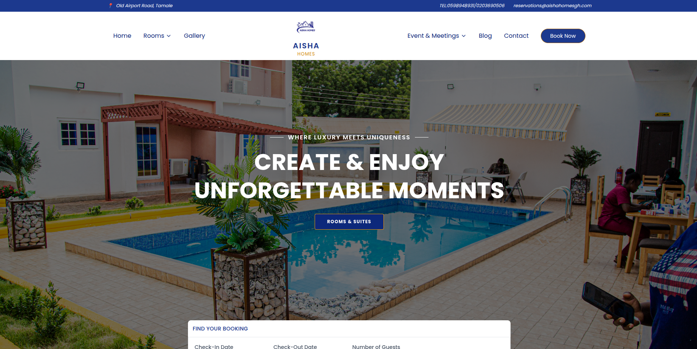

<div align="center">


# 🏨 Aisha Homes Hotel

**A modern, responsive hotel website built with React, Tailwind CSS & Vite**

[](https://react.dev)
[](https://tailwindcss.com)
[](https://vitejs.dev)
[](LICENSE)

[Live Demo](#) · [Report Bug](#) · [Request Feature](#)

</div>


## 📸 Preview




## ✨ Features

- 🖼️ **Responsive Hero Section** — Full-screen background with tagline and CTA
- 🎬 **YouTube Video Popup** — Walkthrough video with animated play button
- 🧭 **Smart Navigation** — Glassmorphism navbar, mobile slide-out drawer
- 🛏️ **Rooms & Suites** — Showcase pages for all room types
- 📅 **Booking Flow** — Integrated booking page with routing
- 🖼️ **Gallery** — Image gallery for hotel visuals
- 📰 **Blog & Newsletter** — Content pages for events and updates
- 📱 **Mobile-First Design** — Fully responsive across all screen sizes
- ✨ **Smooth Animations** — AOS (Animate On Scroll) integration
- 🔍 **SEO Friendly** — Semantic HTML with meta tags


## ⚙️ Tech Stack

| Technology | Purpose |
|---|---|
| [React 18](https://react.dev) | Front-end UI library |
| [Tailwind CSS](https://tailwindcss.com) | Utility-first styling |
| [Vite](https://vitejs.dev) | Build tool & dev server |
| [React Router v6](https://reactrouter.com) | Client-side routing |
| [AOS](https://michalsnik.github.io/aos/) | Scroll animations |


## 🚀 Getting Started

### Prerequisites

- Node.js `v18+`
- npm or yarn

### Installation

```bash
# 1. Clone the repo
git clone https://github.com/yourusername/aisha-homes.git
cd aisha-homes

# 2. Install dependencies
npm install

# 3. Start the dev server
npm run dev
```

Open [http://localhost:5173](http://localhost:5173) in your browser.

### Build for Production

```bash
npm run build
```

Output will be in the `dist/` folder, ready to deploy.


## 📁 Project Structure

```
aisha-homes/
├── public/                 # Static assets
│   ├── Aishahomeslogobg.png
│   └── Walkthrough-video.jpg
├── src/
│   ├── components/
│   │   ├── layout/         # Layout, Footer
│   │   └── ui/             # Nav, TopBar, buttons
│   ├── pages/              # Route-level pages
│   ├── hook/               # Custom React hooks
│   ├── main.jsx            # App entry point
│   └── index.css           # Global styles + Tailwind
├── index.html
├── package.json
├── tailwind.config.js
└── vite.config.js
```


## 🎨 Customization

| What | Where |
|---|---|
| Logo & favicon | `public/` + `index.html` |
| Brand colors | `tailwind.config.js` |
| Hero background | `public/Walkthrough-video.jpg` |
| Walkthrough video | YouTube embed ID in `CtaSection.jsx` |
| Nav links | `src/components/ui/Nav.jsx` |
| SEO meta tags | `index.html` |


## 📄 License

This project is open-source and free to use for personal or commercial projects.


<div align="center">

Built with ❤️ for **Aisha Homes Hotel**.

</div>
